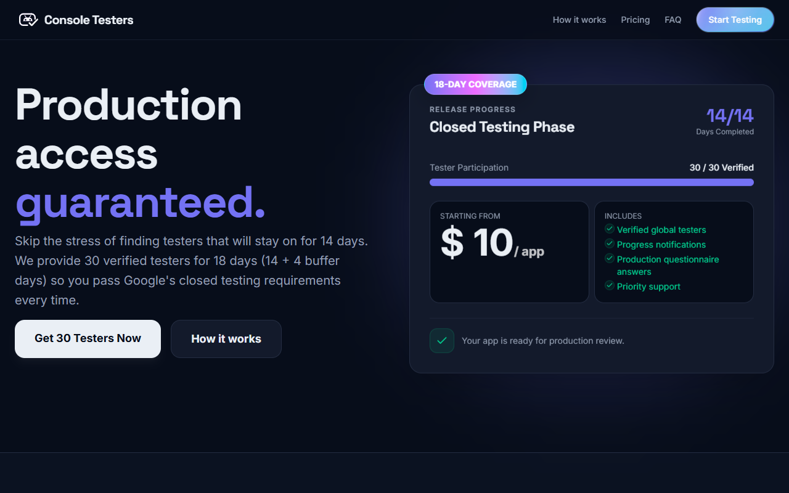
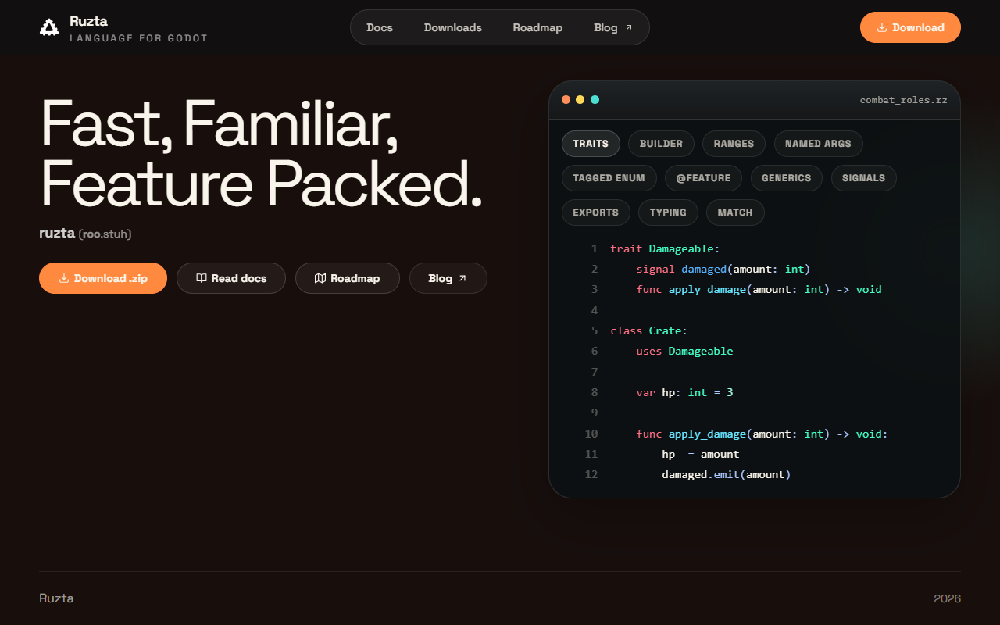
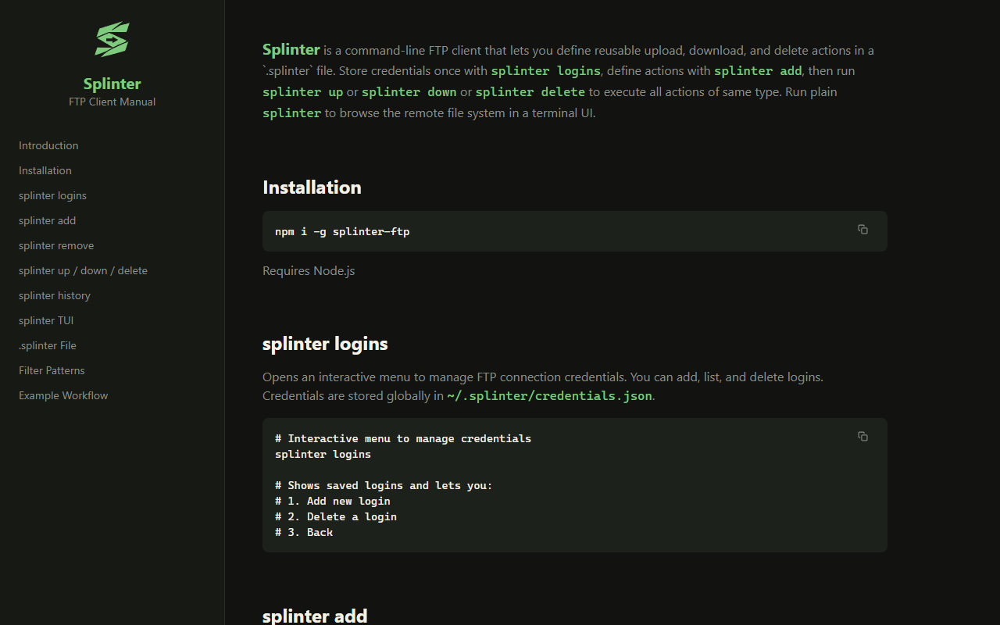
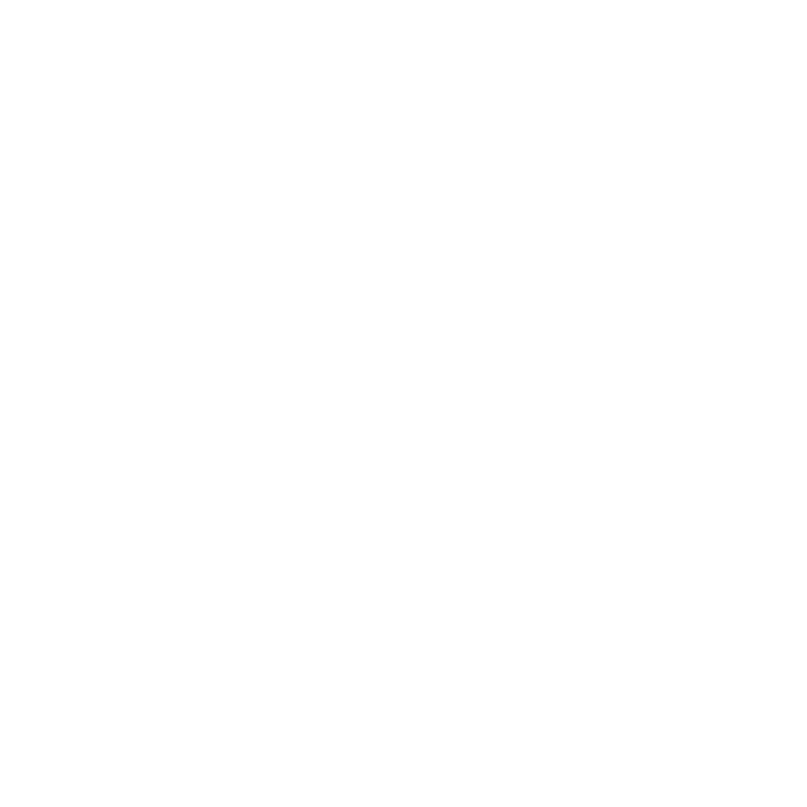
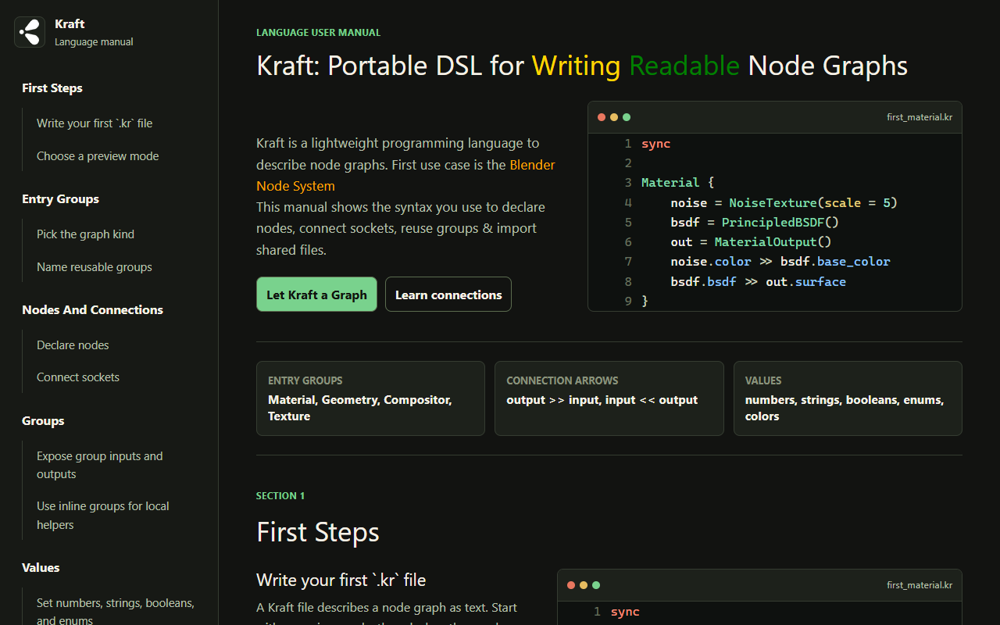
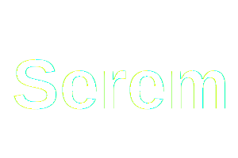
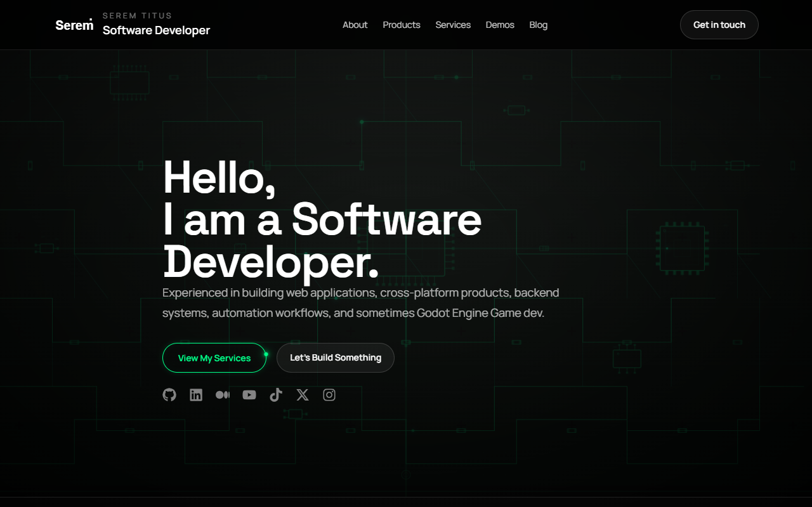

<h1 align="center">Hi there 👋, I am Serem Titus</h1>
<h2 align="center">
  <a href="https://SeremTitus.co.ke" target="_blank" style="text-decoration:none; color:inherit;">
    SeremTitus.co.ke
  </a>
</h2>

    
    
    
    
    
    

---

<table style="border:none;border-collapse:collapse"><tr><td style="border:none;padding-right:10px"></td><td style="border:none"><h1><a href="https://consoletesters.com" target="_blank">Console Testers</a></h1></td></tr></table>

A platform built to support PlayStore developers.

---

<table style="border:none;border-collapse:collapse"><tr><td style="border:none;padding-right:10px"></td><td style="border:none"><h1><a href="https://ruzta.seremtitus.co.ke" target="_blank">Ruzta</a></h1></td></tr></table>

A domain-specific language built to supercharge game development in Godot Engine.

---

<table style="border:none;border-collapse:collapse"><tr><td style="border:none;padding-right:10px"></td><td style="border:none"><h1><a href="https://splinter.seremtitus.co.ke" target="_blank">Splinter FTP Client</a></h1></td></tr></table>

A CLI tool for quick, repetitive uploads and downloads to/from your server, using FTP.

---

<table style="border:none;border-collapse:collapse"><tr><td style="border:none;padding-right:10px"></td><td style="border:none"><h1><a href="https://kraft.seremtitus.co.ke" target="_blank">Kraft</a></h1></td></tr></table>

A portable domain-specific language to write readable node graphs eg Blender Node System.

---

<table style="border:none;border-collapse:collapse"><tr><td style="border:none;padding-right:10px"></td><td style="border:none"><h1><a href="https://seremtitus.co.ke" target="_blank">seremtitus.co.ke</a></h1></td></tr></table>

My own Personal/Freelance website.

---

